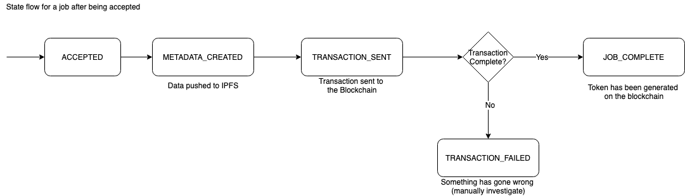
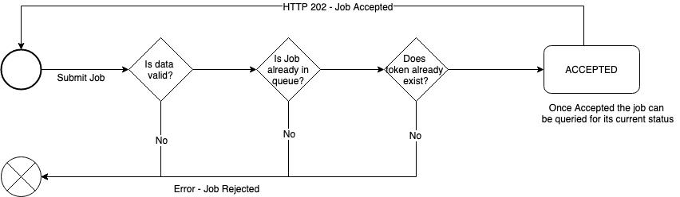

# TokenLandia API

[](https://github.com/blockrockettech/tokenlandia-api/actions)

### Running locally
Install the dependencies: 

    npm i

Fire it up:

    npm run start

## Prerequisites

#### Switching networks

All API endpoints are network aware, this is so we can point the API to either `Rinkeby` for test or `mainnet` for production

* When ever you see `/network/{chainId}` - `{chainId}` needs to be replaced with one of the following:
    - `1` - For the `main` ethereum network
    - `4` - For the `rinkeby` test ethereum network
    
#### Security

Those endpoints which submit jobs to a network require a specific query param `key` to be provided.

If one is not provided an error response will be returned e.g. `?key={uuid-key}`

## API functions

The API consists of several different endpoints allow different operations to be performed.

## GET token information

You can then hit the following `GET` endpoint:

    /v1/network/{chainId}/asset/{tokenIdOrProductId}
    
Replacing `{chainId}` and `{tokenIdOrProductId}` as appropriate.

This will return information about a token ONLY once it has been minted to the blockchain.

For example - this `HTTP` `GET` request we could run is:

    https://api-56b6el2v7a-uc.a.run.app/v1/network/4/asset/info/1
    
This is for chain ID `4` / `rinkeby` and token ID `1`. There are 3 tokens (token ID 1-3) minted on rinkeby.

The expected response would be:

```
{
    product_code: "ASM-JSH-001-0001",
    product_id: "ASM-JSH-001-0001-1",
    token_id: "1",
    token_uri: "https://ipfs.infura.io/ipfs/QmZvyK4dmEFJ4mjpRxEnsstqPcAsNnNRZkdwwJm3DPpTnr",
    open_sea_link: "https://rinkeby.opensea.io/assets/0xD2d84c15Eda5E93aa15f9DDCAA029eaa3f524aDa/1",
    etherscan_link: "https://rinkeby.etherscan.io/token/0xD2d84c15Eda5E93aa15f9DDCAA029eaa3f524aDa?a=1",
    name: "Token 1",
    description: "Token 1 Desc",
    image: "https://ipfs.infura.io/ipfs/QmXhGB4gbUnZgiaFSjL5r8EVHk63JdPasUSQPfZrsJ2cGf",
    type: "PHYSICAL_ASSET",
    created: 1579181406,
    attributes: {
        coo: "ASM",
        initials: "JSH",
        token_id: "1",
        purchase_location: "Token 1 Purchase Loc",
        customization_location: "Token 1 Cust Loc",
        brand: "Token 1 Brand",
        model: "Token 1 Model",
        artist: "Token 1 Art",
        artist_assistant: "Token 1 Assistant",
        material_1: "Cotton",
        product_id: "ASM-JSH-001-0001-1",
        series: "001",
        design: "0001",
        purchase_date: "2020-01-02",
        customization_date: "2020-01-02"
    }
}
```

## Creating New Tokens

Blockchains are asynchronous in nature and the current implementation of the job processing queue simply sends 
transactions from one account, one at a time. 

The functions are designed to validate and accept large batches of jobs however each job is then processed sequentially, one at a time.

This API is currently split into 3 parts, below I will go over each endpoint:

* [Submit Job](#submit-job) - add a new job to the queue to be processed
* [Get Job Status](#get-job-status) - get the status of the job in the queue
* [Get Queue Summary](#get-queue-summary) - get the total number of outstanding jobs in the queue

When jobs are processed they go through a set of finite states which as seen below.

A breakdown of each state is as follows:

* `ACCEPTED`            - Job is valid and has been accepted
* `METADATA_CREATED`    - Token metadata is being created and saved to IPFS
* `TRANSACTION_SENT`    - Create token transaction has been sent to the blockchain
* `JOB_COMPLETE`        - The token has been successfully minted to the blockchain
* `TRANSACTION_FAILED`  - Something has gone wrong and the job has failed



#### Submit Job

Submit a new token creation job e.g.

* `HTTP` `POST` `https://api-56b6el2v7a-uc.a.run.app/v1/network/4/job/submit/createtoken/general?key={uuid-key}`

Sample request body

```
{
    'token_id': ${tokenId},
    'coo': 'USA',
    'artist_initials': 'RSA',
    'series': '002',
    'design': '0003',
    'name': `a name`,
    'description': `a description`,
    'image': 'http://preview.tokenlandia.com/wp-content/uploads/2019/11/b8e4d509cb644e254fbc16eb6a53fd48_listingImg_IOznWUjgk6.jpg',
    'artist': 'artist',
    'artist_assistant': 'assistant',
    'brand': 'brand',
    'model': 'model',
    'purchase_location': 'london',
    'purchase_date': '2020-02-01',
    'customization_location': 'tokyo',
    'customization_date': '2020-02-06',
    'materials_used': [
      'a',
      'b'
    ]
}
```

--------------------

Sample successful job created `JSON` response

```
{
    "jobId": "AoHZeOquKMZe9SFGnquD",
    "chainId": "4",
    "tokenId": "112",
    "status": "ACCEPTED",
    "jobType": "CREATE_TOKEN",
    "createdDate": 1582713451790,
    "context": {
        "ACCEPTED": {
           ...The accepted and formatted data
        }
    }
}
```

* `jobId` is the ID of the newly created job and can be used to now query the stats of it

--------------------

Sample failure - HTTP status 400
```
{
    "error": "Duplicate Job found",
    "existingJob": [
	...
    ]
}
```

##### Validation

Before a job is accepted several things are validated.

If any of these things fail a HTTP `400` will be returned with the reason for the failure.

* No existing job should exist for that token given token
* No existing token should already exist with that ID
* The post body should be valid
* If its not valid we will tell you what's wrong with the data



### Get Job Status

This API can be used to get the status about a specific job which has been previously accepted.

`HTTP` `GET` `https://api-56b6el2v7a-uc.a.run.app/v1/network/4/job/submit/details/${JOB_ID}?key={uuid-key}`

```
{
    "jobId": "PXVA3FsAwzPlmvT10QJf",
    "createdDate": 1582292771324,
    "chainId": "4",
    "status": "TRANSACTION_SENT",
    "jobType": "CREATE_TOKEN",
    "tokenId": "616",
    "context": {
      	… the job data
    }
}
```

One a job has been accepted you can poll this endpoint to see its progress through the processing queue, each token 
can take a few minutes to process.


### Get Queue Summary

This API gives you details on how many jobs are at each stage of the processing queue.

`HTTP` `GET` `https://api-56b6el2v7a-uc.a.run.app/v1/network/4/job/summary?key={uuid-key}`

```
{
    "numOfJobsForJobType": 102,
    "numOfAcceptedJobs": 0,
    "numOfMetadataCreatedJobs": 14,
    "numOfTransactionSentJobs": 0,
    "numOfJobCompleteJobs": 88,
    "numOfTransactionFailedJobs": 0
}
```
