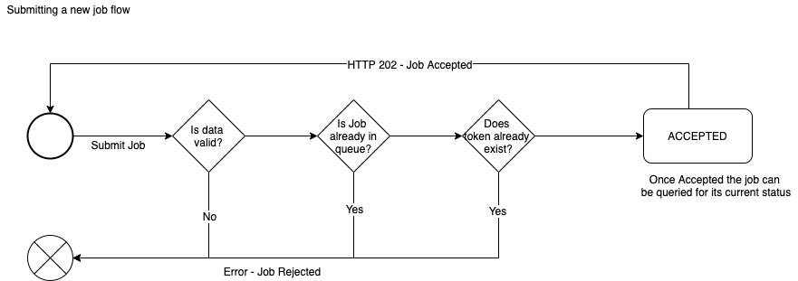

## Creating New Tokens

This documents how the API allows you to create new tokens.

Both `Tokenlandia` and `VideoLatino` tokens can be created using the correct endpoint below.

### Validation 

Before a job is accepted several things are validated based on the token type.

If any of these things fail a HTTP `400` will be returned with the reason for the failure.

* No existing create job should exist for that token
* No existing token should already exist with that ID
* The post body should be valid



&nbsp;
### Creating a Tokenlandia token

* `HTTP` `POST` `https://api-56b6el2v7a-uc.a.run.app/v1/network/4/job/submit/createtoken/general?key={uuid-key}`

Sample request body

```json
{
    'token_id': ${tokenId},
    'coo': 'USA',
    'artist_initials': 'RSA',
    'series': '002',
    'design': '0003',
    'name': `a name`,
    'description': `a description`,
    'image': 'http://preview.tokenlandia.com/wp-content/uploads/2019/11/b8e4d509cb644e254fbc16eb6a53fd48_listingImg_IOznWUjgk6.jpg',
    'artist': 'artist',
    'artist_assistant': 'assistant',
    'brand': 'brand',
    'model': 'model',
    'purchase_location': 'london',
    'purchase_date': '2020-02-01',
    'customization_location': 'tokyo',
    'customization_date': '2020-02-06',
    'material_1': 'a' // Can have up to 5 materials (all optional)
}
```

--------------------

Sample successful job created `JSON` response

```json
{
    "jobId": "AoHZeOquKMZe9SFGnquD",
    "chainId": "4",
    "tokenId": "112",
    "status": "ACCEPTED",
    "jobType": "CREATE_TOKEN",
    "createdDate": 1582713451790,
    "context": {
        "ACCEPTED": {
           ...The accepted and formatted data
        }
    }
}
```

* `jobId` is the ID of the newly created job and can be used to now query the stats of it

--------------------

* Failure - Invalid Token Data - `HTTP` status `400`
```json
{
    "error": "Invalid job data",
    "details": [
	    ...a list of errors found
    ]
}
```

* Failure - Token already created - `HTTP` status `400`
```json
{
    "error": "Token already created"
}
```

* Failure - Duplicate Job - `HTTP` status `400`
```json
{
    "error": "Duplicate Job found",
    "existingJob": {
	    ...the exisiting job
    }
}
```

&nbsp;
### Creating a VideoLatino token

* `HTTP` `POST` `https://api-56b6el2v7a-uc.a.run.app/v1/network/4/job/submit/createtoken/videolatino?key={uuid-key}`

Sample request body

```json
{
    "token_id": 4,
    "coo": "GBR",
    "celebrity_initials": "RSA",
    "name": "token 4",
    "description": "token 4 description",
    "image": "https://ichef.bbci.co.uk/news/320/cpsprodpb/14C0F/production/_110970058_gettyimages-147807964-1.jpg",
    "video_link": "https://ichef.bbci.co.uk/news/320/cpsprodpb/14C0F/production/_110970058_gettyimages-147807964-1.jpg",
    "video_category": "PubliVideos",
    "video_language": "EN",
    "celebrity_name": "Shakira",
    "creation_location": "London",
    "creation_date": "2020-06-24",
    "business_brand": "amazing records"
}
```

--------------------

Sample successful job created `JSON` response

```json
{{
     "jobId": "MeU44ME3t6GhxkhtEWOF",
     "chainId": "4",
     "tokenId": "4",
     "status": "ACCEPTED",
     "jobType": "CREATE_TOKEN",
     "tokenType": "VIDEO_LATINO",
     "createdDate": 1593097189786,
     "context": {
         "ACCEPTED": {
             "token_id": 4,
             "coo": "GBR",
             "celebrity_initials": "RSA",
             "name": "token 4",
             "description": "token 4 description",
             "image": "https://ichef.bbci.co.uk/news/320/cpsprodpb/14C0F/production/_110970058_gettyimages-147807964-1.jpg",
             "video_link": "https://ichef.bbci.co.uk/news/320/cpsprodpb/14C0F/production/_110970058_gettyimages-147807964-1.jpg",
             "video_category": "PubliVideos",
             "video_language": "EN",
             "celebrity_name": "Shakira",
             "creation_location": "London",
             "creation_date": "2020-06-24",
             "business_brand": "amazing records",
             "type": "VIDEO_LATINO",
             "product_id": "GBR-RSA-4",
             "product_code": "GBR-RSA"
         }
     }
 }
```

#### Deleting a Job

You can delete/cancel jobs which are only at the stage "ACCEPTED".

* `HTTP` `DELETE` `https://api-56b6el2v7a-uc.a.run.app/v1/network/4/job/cancel?key={uuid-key}`

With body

```json
{
    "job_id": "<job-id>",
    "token_type": "<token-type>"
}
```

`token_type` needs to be either `TOKENLANDIA` or `VIDEO_LATINO`