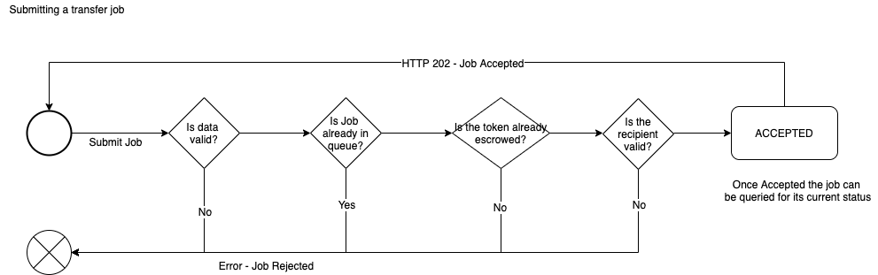

## Creating New Tokens

This API allows you to transfer the token to a new address from the escrow contract

#### Submit Job

Submit a new token creation job e.g.

* `HTTP` `POST` `https://api-56b6el2v7a-uc.a.run.app/v1/network/4/job/submit/transfer?key={uuid-key}`

Sample request body

```json
{
    'token_id': ${tokenId},
    'recipient': '0x9474CE90A96Ca3907428F22F202F72C55559df4a'
}
```

--------------------

Sample successful job created `JSON` response

```json
{
    "jobId": "AoHZeOquKMZe9SFGnquD",
    "chainId": "4",
    "tokenId": "112",
    "status": "ACCEPTED",
    "jobType": "CREATE_TOKEN",
    "createdDate": 1582713451790,
    "context": {
        "ACCEPTED": {
           ...The accepted and formatted data
        }
    }
}
```

* `jobId` is the ID of the newly created job and can be used to now query the stats of it

--------------------

* Failure - Invalid Token Data - `HTTP` status `400`
```json
{
    "error": "Invalid job data",
    "details": [
	    ...a list of errors found
    ]
}
```

* Failure - Token not help in escrow - `HTTP` status `400`
```json
{
    "error": "`Rejecting incoming job - tokenId [${token_id}] is not escrowed for chainId [${chainId}]`"
}
```

* Failure - Invalid recipient provided - `HTTP` status `400`
```json
{
    "error": "Rejecting incoming job - recipient [${recipient}] is not a valid web3 address"
}
```

* Failure - Duplicate Job - `HTTP` status `400`
```json
{
    "error": "Duplicate Job found",
    "existingJob": {
	    ...the exsiting job
    }
}
```

##### Validation

Before a job is accepted several things are validated.

If any of these things fail a HTTP `400` will be returned with the reason for the failure.

* The post body should be valid
* No existing transfer job should exist for that token
* Token should be held in escrow
* Recipient should be a valid Ethereum address

