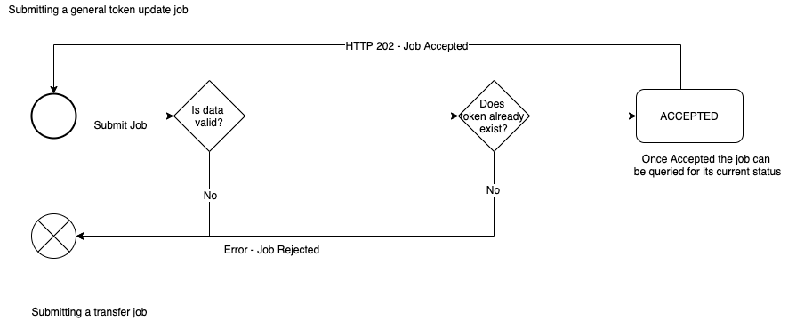

## Updating Token Metadata

This API allows you to update certain fields within a tokens metadata

#### Submit Job

* `HTTP` `POST` `https://api-56b6el2v7a-uc.a.run.app/v1/network/4/job/submit/updatetoken/general?key={uuid-key}`

Sample request body

```json
{
    "token_id": 1,
    "purchase_location": "manchester",
    "purchase_date": "2020-03-11",
    "customization_location": "japan",
    "customization_date": "2020-03-11",
    "material_1": "a1",
    "material_2": "b2",
    "material_3": "c3",
    "material_4": "d3",
    "material_5": "e3"
}
```

--------------------

Sample successful job created `JSON` response

```json
{
    "jobId": "AoHZeOquKMZe9SFGnquD",
    "chainId": "4",
    "tokenId": "1",
    "status": "ACCEPTED",
    "jobType": "CREATE_TOKEN",
    "createdDate": 1582713451790,
    "context": {
        "ACCEPTED": {
           ...The accepted and formatted data
        }
    }
}
```

* `jobId` is the ID of the newly created job and can be used to now query the stats of it

--------------------

* Failure - Invalid Token Data - `HTTP` status `400`
```json
{
    "error": "Invalid job data",
    "details": [
	    ...a list of errors found
    ]
}
```

* Failure - Token does not exist - `HTTP` status `400`
```json
{
    "error": "Token does not exist"
}
```

##### Validation

Before a job is accepted several things are validated.

If any of these things fail a HTTP `400` will be returned with the reason for the failure.

* The post body should be valid
* The token should already exist

